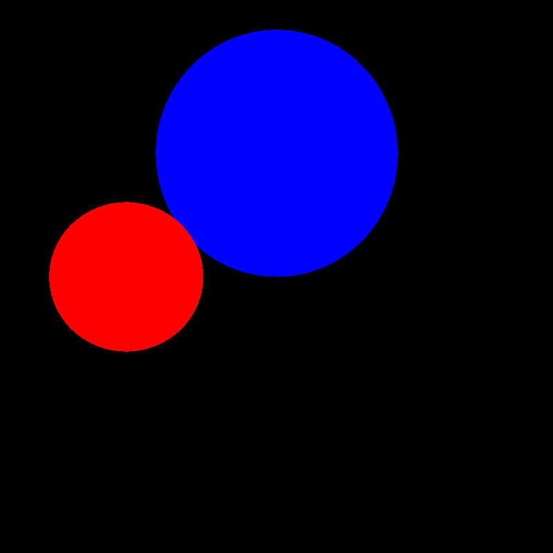

# LRAY

Simple ray tracing in C++.

Uses [JsonCpp](https://github.com/open-source-parsers/jsoncpp) (amalgamated version included in source, no installation needed).

## Description

LRAY takes scene data input in the form of a [JSON](https://www.json.org/json-en.html) file and produces image output into a plain [PPM](http://netpbm.sourceforge.net/doc/ppm.html) image file.

## Compilation

Makefile included. Run `make` to install.

```bash
make
```

## Usage

Run `lray` with these options : level, input file and output file.

```bash
lray -n 1 -i <source> -o <destination>
```

| Option         | Type     | Value                                                        |
| -------------- | -------- | ------------------------------------------------------------ |
| `-n` (level)   | `int`    | Level of the ray tracing algorithm.<br />`1` : flat painting<br />`2` : interactive ray tracing (not implemented)<br />`3` : recursive interactive ray tracing (not implemented) |
| `-i` (input)   | `string` | Path to the JSON input file.                                 |
| `-o ` (output) | `string` | Path to the wanted PPM outpt file.                           |

## Example

Example scene data included in `example_scene.json`.

Run with these options to generate the resulting `example_scene.ppm` image.

```bash
lray -n 1 -i example_scene.json -o example_scene.ppm
```



## JSON Scene Data Format

JSON scene data must include two arrays : `cameras` and `objects`.

* Cameras (multiple cameras not implemented, only first camera is used)
  * `ox`, `oy`, `oz` are the origin's coordinates (the point the camera looks from)
  * `tx`, `ty`, `tz` are the target's coordinates (the point the camera looks at)

* Objects
  * `type` is the object's type and determines what other characteristics the object has
  * `r`, `g`, `b` are the object's color values (values are `double` between `0.0` and `1.0`)
* Additional characteristics for `sphere`
  * `cx`, `cy`, `cz` are the sphere's center's coordinates
  * `radius` is the sphere's radius

Scene example file `example_scene.json` has one camera and two sphere objects.

```json
{
	"cameras":
	[
		{"ox":0,"oy":0,"oz":5,"tx":0,"ty":0,"tz":0}
	],

	"objects":
	[
		{"type":"sphere", "cx":0, "cy":1, "cz":0, "radius":1.0, "r":0.5, "g":0.5, "b":1.0},
		{"type":"sphere", "cx":-1, "cy":0, "cz":1, "radius":0.5, "r":1.0, "g":0.5, "b":0.5}
	]
}
```

